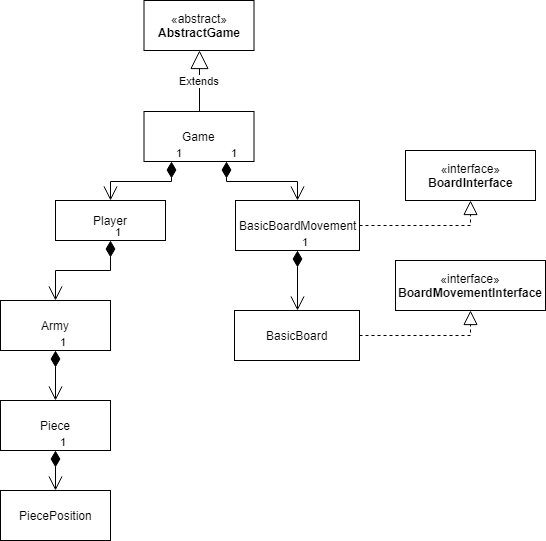
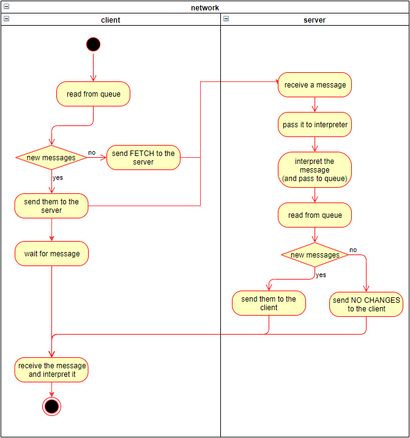

# Chinese Checkers
>Great fun

~someone, probably
## Introduction
Java project made for university course using frontend in JavaFX, custom written backend using plain sockets and Junit tests.

Authors:
- @Bartor 
- @pi-kolo

## Structure

The project is divided into three main parts:
- [model](src/main/java/model)
- [backend](src/main/java/backend)
- [frontend](src/main/java/frontend)

Each part has a distinct role and specification.

### Model

Model divides the game into crucial parts. It defines behaviour of the pieces, structure of the board, holds players etc. The entry point for model is [AbstractGame](src/main/java/model/game/AbstractGame.java) in the [Game](src/main/java/model/game)  package, implemented by [BasicGame](src/main/java/model/game/BasicGame.java) (which is actually used by this particular front- and backend). It holds all the players ([Player](src/main/java/model/player/Player.java)) and [BoardMovementInterface](src/main/java/model/board/BoardMovementInterface.java), lets you add more players and more.

Next two important classes are `Player` and `BoardMovementInterface` highlighted before. Each `Player` holds and [Army](src/main/java/model/player/Army.java), which consists of pieces ([Piece](src/main/java/model/player/Piece.java)). Army is important, because it let's you search for a piece using only position and also allows one player to have multiple armies in the future. A singlie `Piece` has its position represented by a [PiecePosition](src/main/java/model/player/PiecePosition.java) to allow easier comparisons and method calls.

`BoardMovementInterface` implemented by [BasicBoardMovement](src/main/java/model/board/BasicBoardMovement.java) takes care of moving the pieces. It holds a [BoardInterface](src/main/java/model/board/BoardInterface.java) implemented by [BasicBoard](src/main/java/model/board/BasicBoard.java) which represents starting (and winning at the same time) positions for all the players as well as current piece positions. `BoardMovementInterface` allows to make moves and changes position both in the involved pieces and its `BoardInterface`.

Simple model diagram:

### Backend

Entry point for the backend is a console application [Main](src/main/java/backend/Main.java) which is started with params `port number_of_players board_file`. File is then loaded and send to all connecting players, so they don't really have to have it locally at all. Server is multi-threaded and each client has its separate thread.

[Socketing](src/main/java/backend/socketing) holds all classes important for sending and receiving data. [Server](src/main/java/backend/socketing/Server.java) allows players to connect and [ServerClient](src/main/java/backend/socketing/ServerClient.java) launches a separate thread, receives new data from its client, passes it to `MessageInterpreter` (described below) and then read from the [MessageQueueSingleton](src/main/java/backend/socketing/MessageQueueSingleton.java) which hold everything each clients _has to_ receive. The data is compared to that already sent to a particular client and then updated accordingly.

[MessageInterpreter](src/main/java/backend/interpreter/MessageInterpreter.java) interprets incoming messages and then modifies game stored int [GameSingleton](src/main/java/backend/GameSingleton.java) accordingly, also updated the queue at `MessageQueueSingleton`.

### Frontend

Frontend manages interactions with user and defines connection with a server. Stating point of the frontend is [ChineseCheckersApplication](src/main/java/frontend/ChineseCheckersApplication.java) which launches the JavaFX interface. Packages inside the frontend include [util](src/main/java/frontend/util), [networking](src/main/java/frontend/networking) and [controllers](src/main/java/frontend/controllers) which I'll explain now shortly.

`controllers` package contains the most important class of user-side game, [AbstractController](src/main/java/frontend/controllers/AbstractController.java). All the other scene controllers extend it. It holds and instance of the game, a reference to `SceneController` (described below) and defines basic interaction between controllers and it. There are three scenes, [Game](src/main/resources/views/game.fxml), [Pregame](src/main/resources/views/pregame.fxml) and [Start](src/main/resources/views/start.fxml) with controllers named alike.

`networking` holds connectivity and interaction with the server. It defines a [Client](src/main/java/frontend/networking/Client.java) which launches a [ClientThread](src/main/java/frontend/networking/ClientThread.java) which fetches data from server in given intervals. [MessageInterpreter](src/main/java/frontend/networking/MessageInterpreter.java) is then used to analyze this messages and then proceeds to use `NetworkControllerFacade` (described below) to change the ui.

`util` package holds everything which couldn't be put anywhere else. It has [BoardField](src/main/java/frontend/util/BoardField.java) and [LobbyUser](src/main/java/frontend/util/LobbyUser.java) classes which are used to create particular repeating patterns in the ui. [NetworkControllerFacade](src/main/java/frontend/util/NetworkControllerFacade.java) and [ControllerNetworkFacade](src/main/java/frontend/util/NetworkControllerFacade.java) are an addition abstraction layer between the ui and the networking, which should allow to easily extend the application.

## Networking

Network in this project heavily relies on the message queues idea which makes it kind of possible to achieve some level of asynchronous processing of incoming data. Network activity diagram below illustrates it very good:

## Further documentation

All classes are documented using javadoc compliant comments, you can generate yourself docs using your favourite javadoc tool.